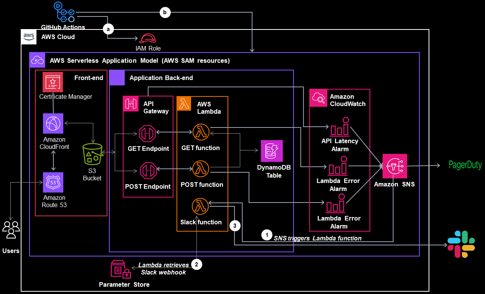

# CLOUD RESUME CHALLENGE

This project repository showcases the work I've done and skills I've gained after embarking on the cloud resume challenge.

## Project Overview

The Cloud Resume Challenge provided an excellent opportunity to delve into various aspects of cloud computing and full-stack software development. As I started the challenge, I quickly realized that the challenge is exactly the way Brazeal Forrest projected it — **it's a project spec** — and having to research intensively to figure out how to solve all the challenges helped me to gain useful experience not just with the Cloud services used but also a good understanding of the fullstack software development (frontend and backend), version control, CI/CD, Infrastructure as Code and others.

## Architecture

The architectural diagram below explains how different services and tools used for this project connect with each other. Please zoom out to view clearly.

### Frontend

- **AWS S3**: Stores website files.
- **Amazon CloudFront**: Delivers content with AWS Certificate Manager for secure connections.
- **Amazon Route53**: Implements a custom domain, directing requests to CloudFront.
- **AWS Certificate Manager**: Attached to cloudfront for secure http (https) connection.

### Backend

- **Amazon API Gateway**: Triggered by website visitations.
- **AWS Lambda Functions**: Triggered by API. Handle visitor count, posting to and retrieving from DynamoDB database.
- **DynamoDB**: Stores visitor count data.

### Monitoring and Notifications

- **Amazon CloudWatch Alarms**: Monitor metrics and sends messages to SNS.
- **Amazon SNS**: Sends notifications to subscribers, with Pagerduty and a Lambda function subscribed to it.
- **AWS SSM Parameter Store**: Stores Slack webhook URL that Lambda uses for sending notifications.

### Testing and Automation

- **Cypress**: Conducts end-to-end testing of the website and API.
- **GitHub Actions**: CI/CD tool that automates the build, deployment, and testing of my application.

## AWS SAM Integration

The application's resources are defined in the `template.yaml` file in this project, using the AWS Serverless Application Model (AWS SAM). AWS SAM is an extension of AWS CloudFormation that helps you define your application infrastructure code quickly, using less code. It is mainly used for building, deploying and monitoring serverless applications. Read more about AWS SAM [here](https://docs.aws.amazon.com/serverless-application-model/latest/developerguide/what-is-sam.html).

The repository also contains source codes and other supporting files for the serverless application that I deployed with the SAM CLI.

## Deployed Website

You can find my deployed website [here](https://osu-resume.com.ng) to explore the project in action!
